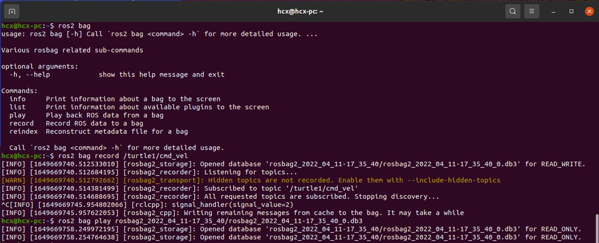

# Ros2系统
## ros2系统操作指令
`ros2 run`这个命令用于在 ROS 2 系统中运行一个特定的可执行文件（通常是一个 ROS 2 节点）。
### 基本语法是：
#### 运行程序
``` bash
ros2 run package_name executable_name
``` 
* `package_name` 是你要运行的节点所在的包的名称。
*  `executable_name` 是你要运行的节点的可执行文件的名称。
#### 查看节点信息
* `ros2 node list`
##### 如果对某一个节点感兴趣，加上一个info子命令，就可以知道它的详细信息啦：
* `ros2 node info /节点所在的包的名称`
### 查看话题信息
* `ros2 topic list `
#### 还想看到某一个话题中的消息数据，加上echo子命令试一试：
* `ros2 topic echo /turtlr1/pose `
### 发布话题消息
* 举例海龟`$ ros2 topic pub --rate 1 /turtle1/cmd_vel geometry_msgs/msg/Twist "{linear: {x: 2.0, y: 0.0, z: 0.0}, angular: {x: 0.0, y: 0.0, z: 1.8}}"
 ` 
### 发送服务请求
* ` $ ros2 service call /spawn turtlesim/srv/Spawn "{x: 2, y: 2, theta: 0.2, name: ''}"
`
### 发送动作目标
* `$ ros2 action send_goal /turtle1/rotate_absolute turtlesim/action/RotateAbsolute "theta: 3"
`
### 录制控制命令
```bash
$ ros2 bag record /turtle1/cmd_vel
$ ros2 bag play rosbag2_2022_04_11-17_35_40/rosbag2_2022_04_11-17_35_40_0.db3
```


