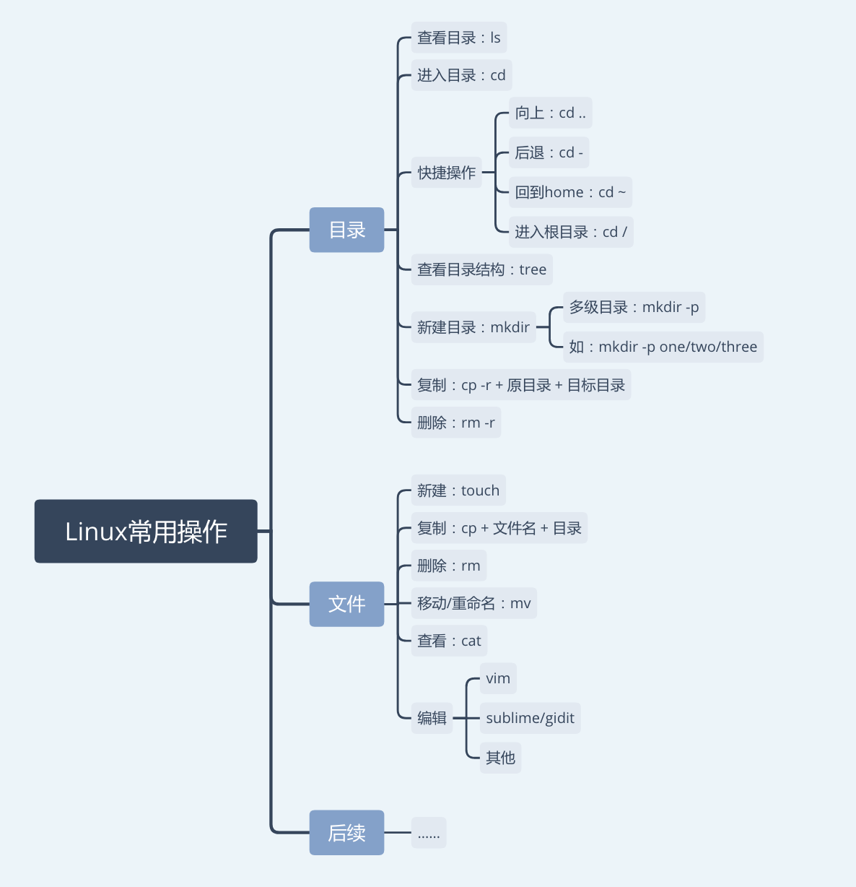
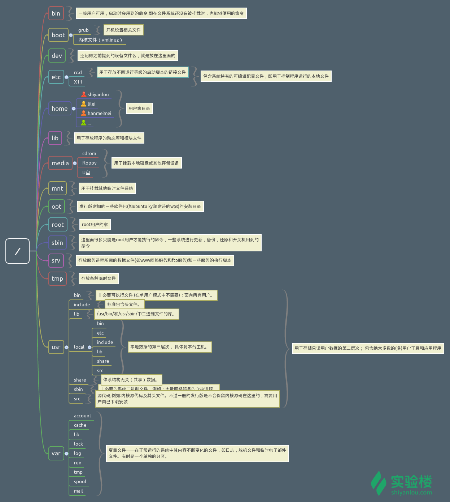
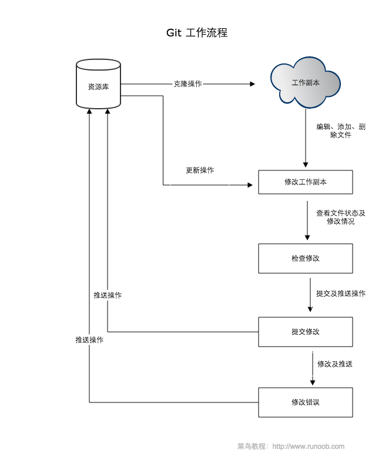
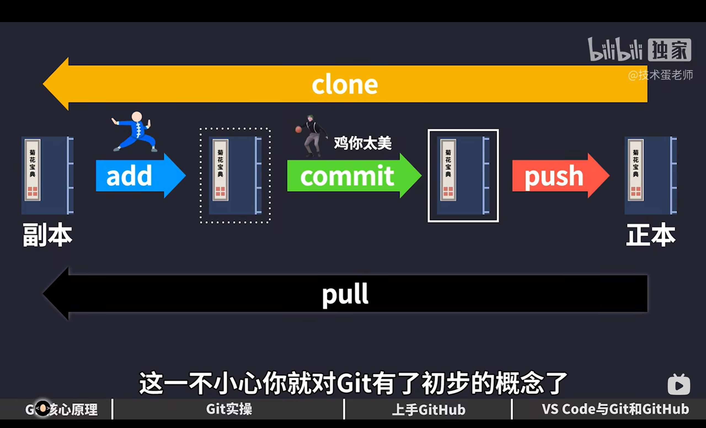
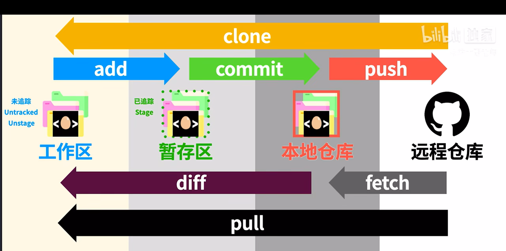

# 第七周笔记


##  实验一Linux

* 1常见的指令



pwd指令是获取当前目录的绝对路径
Linux 进入目录的方式有绝对路径和相对路径两种。

之前我们都是用 相对路径 进入目录的（cd指令），这相当于你在 Windows 系统下，在当前文件夹中点击下一个文件夹进入；

而 绝对路径 是一个以根目录 / 为起点的完整路径，如： /home/shiyanlou/Code，可以类比 Windows 上的 C:\Users\电脑用户名\Desktop。

使用 cp 命令（Copy）复制文件到指定目录下，比如要把 hello 文件复制到 one/two 这个目录下：
` rm -R\r`是递归删除，退出文件夹返回home后可以直接删除文件夹

cp hello one/two/

***如果要复制目录，需要在 cp 后加上 -r ，然后接上 目录名 目标目录名：***

删除目录要加上 -r 选项，类似 cp -r 拷贝目录，会删除目录和目录下的所有内容：

使用 mv 命令 将 test1 移动到 dir1 目录，代码如下：

mv test1 dir1

***mv 命令还可以用来重命名，如 mv test1 test2， 会把 test1 重命名为 test2：***

* 2Linux操作系统简介



***💡 提示：如果忘记了目录名、文件名或命令，可使用 Tab 键自动补全，还可避免输入错误；连续按两次 Tab 可以显示全部候选结果。***

使用 `mkdir` 命令可创建目录，mkdir mycode 的意思就是新建一个名为 mycode 的目录。还可以在 mkdir 后加入 -p 参数，一次性创建多级目录


***apt-get: 是一个高级包管理工具，可以自动解决软件包的依赖关系，并下载并安装软件包及其依赖项。*** 


在Ubuntu中，你可以使用apt-get或者apt来安装软件包。下面是基本的安装软件包的指令：
sudo apt-get install 软件包名称
或者sudo apt install 软件包名称


```bash
dpkg -i  #是一个低级工具，主要用于安装、升级和删除.deb格式的软件包。它不会自动解决依赖关系，仅仅是简单地安装指定的软件包
```

#### weget

weget -c 选项告诉 wget 在下载文件时启用续传功能。如果下载过程中发生中断或者网络连接中断，下次再运行相同的 wget 命令时，wget 将会尝试继续之前的下载，而不是重新开始下载。这个功能特别有用，特别是对于大文件或者网络条件不太好的情况。
例如，你可以这样使用 wget -c 来下载一个文件：

wget -c http://example.com/largefile.zip


### Linux进入虚拟环境


```bash
source myenv/bin/activate
```
```shell
source .venv/bin/activate  
```


### Linux退出虚拟环境

`deactivate`


### 将.ipynb转换为markdown文件

```bash
jupyter nbconvert --to markdown '文件名.ipynb'
```


## 实验二github

### 



### 入门

使用Git前，需要先建立一个仓库(repository)。您可以使用一个已经存在的目录作为Git仓库或创建一个空目录。

使用您当前目录作为Git仓库，我们只需使它初始化。

git init
使用我们指定目录作为Git仓库。

git init newrepo
从现在开始，我们将假设您在Git仓库根目录下，除非另有说明。

#### 添加新文件
我们有一个仓库，但什么也没有，可以使用add命令添加文件。

git add filename
可以使用add... 继续添加任务文件。

#### 提交版本
现在我们已经添加了这些文件，我们希望它们能够真正被保存在Git仓库。

为此，我们将它们提交到仓库。

git commit -m "Adding files"
如果您不使用-m，会出现编辑器来让你写自己的注释信息。

当我们修改了很多文件，而不想每一个都add，想commit自动来提交本地修改，我们可以使用-a标识。

git commit -a -m "Changed some files"
git commit 命令的-a选项可将所有被修改或者已删除的且已经被git管理的文档提交到仓库中。

千万注意，-a不会造成新文件被提交，只能修改。

#### 发布版本
我们先从服务器克隆一个库并上传。

git clone ssh://example.com/~/www/project.git
现在我们修改之后可以进行推送到服务器。

git push ssh://example.com/~/www/project.git
#### 取回更新
如果您已经按上面的进行push，下面命令表示，当前分支自动与唯一一个追踪分支进行合并。

git pull
从非默认位置更新到指定的url。

git pull http://git.example.com/project.git

#### 删除
如何你想从资源库中删除文件，我们使用rm。

git rm file
### 分支与合并
分支在本地完成，速度快。要创建一个新的分支，我们使用branch命令。

git branch test
branch命令不会将我们带入分支，只是创建一个新分支。所以我们使用checkout命令来更改分支。

git checkout test
第一个分支，或主分支，被称为"master"。

git checkout master
对其他分支的更改不会反映在主分支上。如果想将更改提交到主分支，则需切换回master分支，然后使用合并。

git checkout master
git merge test
如果您想删除分支，我们使用-d标识。

git branch -d test






---


***三种办法创建一个干净的仓库***

### 方法一

*  打开网页版GitHub，创建自己的远程仓库 ➜打开电脑终端，输入 ` git clone+code地址`➜然后会创建一个文件（文件名字和远程仓库名字一样），然后在把文件移走到你需要的地方
或者可以提前创一个和你远程仓库名字一样的文件，克隆之后就自动到指定的文件夹

### 方法二

* 先提前建好文件➜然后在vscode打开新建的文件作为工作台➜然后初始化生成git.隐藏目录➜在提交过程中上面搜索栏会让你填写远程仓库的名字（直接建立远程仓库）

### 方法三

* 如果你提前创好了远程仓库但想用这个远程仓库，你需要重新克隆这个地址，然后把你需要的文件拖进来

---

### 补充其他终端指令用法

* `git remote -v`：显示当前仓库已经配置的所有远程仓库的别名和对应的 URL。
* `git remote add` <name> <url>：添加一个新的远程仓库，并指定其别名和 URL。
* `git remote remove` <name>：移除指定名称的远程仓库。
* `git remote rename` <old_name> <new_name>：将已有的远程仓库别名重命名。

***git remote 是用于管理 Git 仓库中远程仓库的命令。它允许你查看当前仓库已经配置了哪些远程仓库，并可以添加、删除或者重命名远程仓库的别名***

### 补充
#### 抓取和拉取的区别
* 抓取和拉取的区别在于是否自动将远程更改合并到本地分支。抓取只会下载远程更改到本地仓库，而拉取会尝试自动将这些更改合并到当前分支中。
#### git pull各种调和命令
* 合并（缺省策略）：这会将远程分支的更改合并到您的本地分支。您可以执行以下命令设置该选项：
```bash
git config pull.rebase false
```
* 变基：这会将您的本地提交“重新播放”在远程分支的顶部。如果您想保持提交历史的整洁，这是一个不错的选择。您可以执行以下命令设置该选项：
```bash
git config pull.rebase true
```
* 仅快进：这只会在您的本地分支可以直接快进到远程分支时才进行更新。如果不能快进，它将会拒绝更新。您可以执行以下命令设置该选项：
```bash
git config pull.ff only
```
