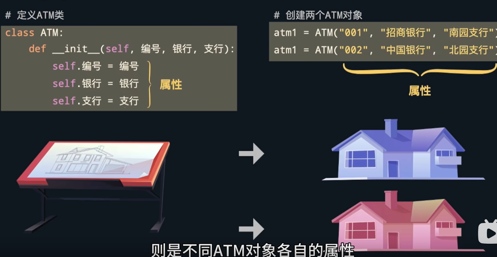
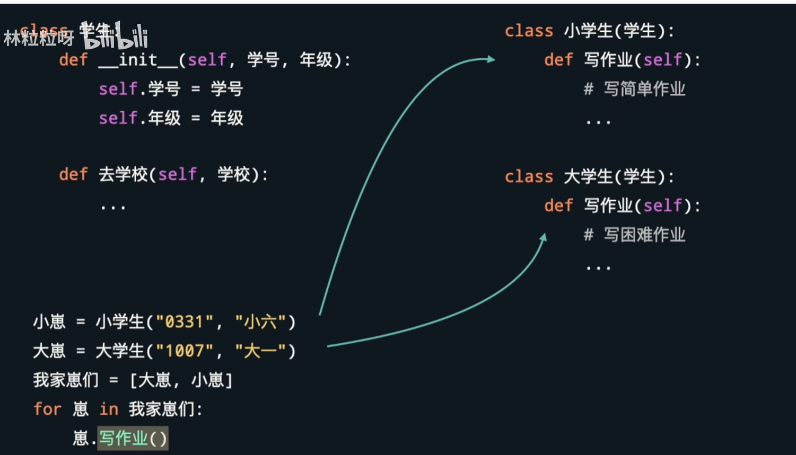

# 面向对象
## 类和对象之间的关系
***类是创建对象的模板，对象是类的实例***

## 面向对象的特性
* 封装
* 继承
* 多态
### 封装
* 它指的是将数据（即对象的状态）和操作数据的方法（即对象的行为）捆绑在一起，并将其视为一个单独的单位。封装通过隐藏对象的内部细节，只暴露必要的接口，从而实现了对象的信息隐藏和保护。
`比如已经写好了洗衣机这个类，你只需要知道它有什么方法，方法有什么作用具体怎么用就可以了，不必知道里面原理 `
#### 封装优点
* `信息隐藏`: 封装使得对象的内部细节对外部代码是不可见的，只有通过公共方法才能进行访问和修改，这样可以隔离对象的实现细节，使得对象的使用者只需要关注对象的接口，而不需要了解其内部实现。

* `数据保护`: 通过将数据私有化，封装可以防止外部代码直接对对象的数据进行修改，从而保护了数据的完整性和一致性。

* `简化复杂性`: 封装使得对象的使用者可以通过简单的接口来操作对象，而不需要了解对象内部的复杂实现细节，从而降低了系统的复杂性，提高了代码的可维护性和可扩展性。
### 继承
*  面向对象编程允许创建有层次的类
* 它允许一个类（称为子类或派生类）基于另一个类（称为父类或基类）定义，并且继承父类的属性和方法。通过继承，子类可以重用父类的代码，并且可以在不修改父类的情况下添加自己的特定功能。在继承中，子类继承了父类的属性和方法，包括公共（public）、受保护（protected）和私有（private）成员，但私有成员通常对子类不可见。子类可以通过继承获得父类的属性和方法，并且可以添加新的属性和方法，也可以重写（override）父类的方法来改变其行为。
#### 继承的优点
* `代码重用`: 继承允许子类重用父类的代码，避免了重复编写相似功能的代码，提高了代码的复用性和可维护性。

* `扩展性`: 子类可以在不修改父类的情况下添加新的功能，从而实现代码的扩展和修改。

* `统一接口`: 继承可以使得对象具有相似的接口，从而方便了对象的使用和理解。

* `多态性`: 继承的一个重要特性是多态性，即子类对象可以被当做父类对象来使用，从而实现了动态绑定和多态的特性。
### 多态
* 指的是同一个消息可以被不同类型的对象所理解和响应，即同一方法调用会根据对象的类型而执行不同的行为。多态性使得代码可以更灵活、更通用，同时提高了代码的可扩展性和可维护性。

#### 多态优点
*  `代码的灵活性和可扩展性`：通过多态性，可以编写出更加通用、灵活的代码，从而提高了代码的可扩展性和可维护性。
*  `简化了代码的逻辑`：通过多态性，可以将对象的具体类型隐藏起来，从而简化了代码的逻辑和实现。

