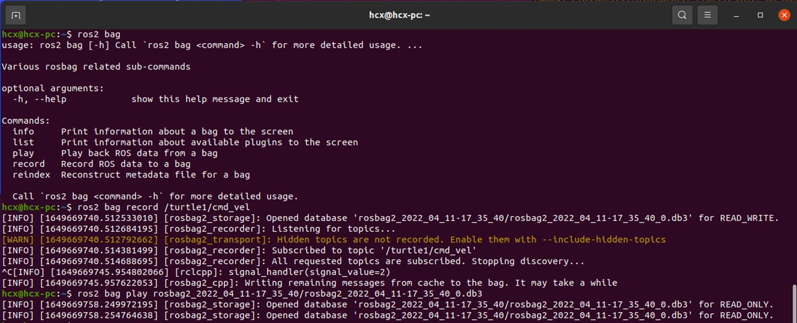

# Ros2系统
## ros2系统操作指令
`ros2 run`这个命令用于在 ROS 2 系统中运行一个特定的可执行文件（通常是一个 ROS 2 节点）。
### 基本语法是：
#### 运行程序
``` bash
ros2 run package_name executable_name
``` 
* `package_name` 是你要运行的节点所在的包的名称。
*  `executable_name` 是你要运行的节点的可执行文件的名称。
#### 查看节点信息
* `ros2 node list`
##### 如果对某一个节点感兴趣，加上一个info子命令，就可以知道它的详细信息啦：
* `ros2 node info /节点所在的包的名称`
### 查看话题信息
* `ros2 topic list `
#### 还想看到某一个话题中的消息数据，加上echo子命令试一试：
* `ros2 topic echo /turtlr1/pose `
### 发布话题消息
* 举例海龟`$ ros2 topic pub --rate 1 /turtle1/cmd_vel geometry_msgs/msg/Twist "{linear: {x: 2.0, y: 0.0, z: 0.0}, angular: {x: 0.0, y: 0.0, z: 1.8}}"
 ` 
### 发送服务请求
* ` $ ros2 service call /spawn turtlesim/srv/Spawn "{x: 2, y: 2, theta: 0.2, name: ''}"
`
### 发送动作目标
* `$ ros2 action send_goal /turtle1/rotate_absolute turtlesim/action/RotateAbsolute "theta: 3"
`
### 录制控制命令
```bash
$ ros2 bag record /turtle1/cmd_vel
$ ros2 bag play rosbag2_2022_04_11-17_35_40/rosbag2_2022_04_11-17_35_40_0.db3
```

### 实现一个发布者
* 编程窗口初始化
* 创建节点并初始化 
* 创建发布者对象
* 创建并填充话题消息
* 发布话题消息
* 销毁节点并关闭接口


#### 举例
```bash
#!/usr/bin/env python3
# -*- coding: utf-8 -*-

"""
@作者: 古月居(www.guyuehome.com)
@说明: ROS2话题示例-发布“Hello World”话题
"""

import rclpy                                     # ROS2 Python接口库
from rclpy.node import Node                      # ROS2 节点类
from std_msgs.msg import String                  # 字符串消息类型

"""
创建一个发布者节点
"""
class PublisherNode(Node):

    def __init__(self, name):
        super().__init__(name)                                    # ROS2节点父类初始化
        self.pub = self.create_publisher(String, "chatter", 10)   # 创建发布者对象（消息类型、话题名、队列长度）
        self.timer = self.create_timer(0.5, self.timer_callback)  # 创建一个定时器（单位为秒的周期，定时执行的回调函数）

    def timer_callback(self):                                     # 创建定时器周期执行的回调函数
        msg = String()                                            # 创建一个String类型的消息对象
        msg.data = 'Hello World'                                  # 填充消息对象中的消息数据
        self.pub.publish(msg)                                     # 发布话题消息
        self.get_logger().info('Publishing: "%s"' % msg.data)     # 输出日志信息，提示已经完成话题发布

def main(args=None):                                 # ROS2节点主入口main函数
    rclpy.init(args=args)                            # ROS2 Python接口初始化
    node = PublisherNode("topic_helloworld_pub")     # 创建ROS2节点对象并进行初始化
    rclpy.spin(node)                                 # 循环等待ROS2退出
    node.destroy_node()                              # 销毁节点对象
    rclpy.shutdown()                                 # 关闭ROS2 Python接口
```
完成代码的编写后需要设置功能包的编译选项，让系统知道Python程序的入口，打开功能包的setup.py文件，加入如下入口点的配置：
```bash
    entry_points={
        'console_scripts': [
         'topic_helloworld_pub  = learning_topic.topic_helloworld_pub:main',
        ],
    },

```
### 实现一个订阅者
* 编程窗口初始化
* 创建节点并初始化 
* 创建订阅者对象
* 回调函数处理话题数据
* 销毁节点并关闭接口
#### 举例
```bash
#!/usr/bin/env python3
# -*- coding: utf-8 -*-

"""
@作者: 古月居(www.guyuehome.com)
@说明: ROS2话题示例-订阅“Hello World”话题消息
"""

import rclpy                      # ROS2 Python接口库
from rclpy.node   import Node     # ROS2 节点类
from std_msgs.msg import String   # ROS2标准定义的String消息

"""
创建一个订阅者节点
"""
class SubscriberNode(Node):

    def __init__(self, name):
        super().__init__(name)                             # ROS2节点父类初始化
        self.sub = self.create_subscription(\
            String, "chatter", self.listener_callback, 10) # 创建订阅者对象（消息类型、话题名、订阅者回调函数、队列长度）

    def listener_callback(self, msg):                      # 创建回调函数，执行收到话题消息后对数据的处理
        self.get_logger().info('I heard: "%s"' % msg.data) # 输出日志信息，提示订阅收到的话题消息

def main(args=None):                               # ROS2节点主入口main函数
    rclpy.init(args=args)                          # ROS2 Python接口初始化
    node = SubscriberNode("topic_helloworld_sub")  # 创建ROS2节点对象并进行初始化
    rclpy.spin(node)                               # 循环等待ROS2退出
    node.destroy_node()                            # 销毁节点对象
    rclpy.shutdown()                               # 关闭ROS2 Python接口

```


完成代码的编写后需要设置功能包的编译选项，让系统知道Python程序的入口，打开功能包的setup.py文件，加入如下入口点的配置：
```bash
    entry_points={
        'console_scripts': [
         'topic_helloworld_pub  = learning_topic.topic_helloworld_pub:main',
         'topic_helloworld_sub  = learning_topic.topic_helloworld_sub:main',
        ],
    },
```
### 话题命令的常用操作
```bash
$ ros2 topic list                # 查看话题列表
$ ros2 topic info <topic_name>   # 查看话题信息
$ ros2 topic hz <topic_name>     # 查看话题发布频率
$ ros2 topic bw <topic_name>     # 查看话题传输带宽
$ ros2 topic echo <topic_name>   # 查看话题数据
$ ros2 topic pub <topic_name> <msg_type> <msg_data>   # 发布话题消息

```
### 实现一个客户端
* 编程窗口初始化
* 创建节点并初始化
* 创建客户端对象
* 创建并发送请求数据
* 等待服务器端应答数据
* 销毁节点并关闭接口
```bash
#!/usr/bin/env python3
# -*- coding: utf-8 -*-

"""
@作者: 古月居(www.guyuehome.com)
@说明: ROS2服务示例-发送两个加数，请求加法器计算
"""

import sys

import rclpy                                  # ROS2 Python接口库
from rclpy.node   import Node                 # ROS2 节点类
from learning_interface.srv import AddTwoInts # 自定义的服务接口

class adderClient(Node):
    def __init__(self, name):
        super().__init__(name)                                       # ROS2节点父类初始化
        self.client = self.create_client(AddTwoInts, 'add_two_ints') # 创建服务客户端对象（服务接口类型，服务名）
        while not self.client.wait_for_service(timeout_sec=1.0):     # 循环等待服务器端成功启动
            self.get_logger().info('service not available, waiting again...') 
        self.request = AddTwoInts.Request()                          # 创建服务请求的数据对象

    def send_request(self):                                          # 创建一个发送服务请求的函数
        self.request.a = int(sys.argv[1])
        self.request.b = int(sys.argv[2])
        self.future = self.client.call_async(self.request)           # 异步方式发送服务请求

def main(args=None):
    rclpy.init(args=args)                        # ROS2 Python接口初始化
    node = adderClient("service_adder_client")   # 创建ROS2节点对象并进行初始化
    node.send_request()                          # 发送服务请求

    while rclpy.ok():                            # ROS2系统正常运行
        rclpy.spin_once(node)                    # 循环执行一次节点

        if node.future.done():                   # 数据是否处理完成
            try:
                response = node.future.result()  # 接收服务器端的反馈数据
            except Exception as e:
                node.get_logger().info(
                    'Service call failed %r' % (e,))
            else:
                node.get_logger().info(          # 将收到的反馈信息打印输出
                    'Result of add_two_ints: for %d + %d = %d' % 
                    (node.request.a, node.request.b, response.sum))
            break

    node.destroy_node()                          # 销毁节点对象
    rclpy.shutdown()                             # 关闭ROS2 Python接口

``` 
完成代码的编写后需要设置功能包的编译选项，让系统知道Python程序的入口，打开功能包的setup.py文件，加入如下入口点的配置：
``` bash
    entry_points={
        'console_scripts': [
         'service_adder_client  = learning_service.service_adder_client:main',
        ],
    },

```
### 实现一个服务端

* 编程接口初始化
* 创建节点并初始化
* 创建服务器端对象
* 通过回调函数处进行服务
* 向客户端反馈应答结果
* 销毁节点并关闭接口
```bash
#!/usr/bin/env python3
# -*- coding: utf-8 -*-

"""
@作者: 古月居(www.guyuehome.com)
@说明: ROS2服务示例-提供加法器的服务器处理功能
"""

import rclpy                                     # ROS2 Python接口库
from rclpy.node   import Node                    # ROS2 节点类
from learning_interface.srv import AddTwoInts    # 自定义的服务接口

class adderServer(Node):
    def __init__(self, name):
        super().__init__(name)                                                           # ROS2节点父类初始化
        self.srv = self.create_service(AddTwoInts, 'add_two_ints', self.adder_callback)  # 创建服务器对象（接口类型、服务名、服务器回调函数）

    def adder_callback(self, request, response):   # 创建回调函数，执行收到请求后对数据的处理
        response.sum = request.a + request.b       # 完成加法求和计算，将结果放到反馈的数据中
        self.get_logger().info('Incoming request\na: %d b: %d' % (request.a, request.b))   # 输出日志信息，提示已经完成加法求和计算
        return response                          # 反馈应答信息

def main(args=None):                             # ROS2节点主入口main函数
    rclpy.init(args=args)                        # ROS2 Python接口初始化
    node = adderServer("service_adder_server")   # 创建ROS2节点对象并进行初始化
    rclpy.spin(node)                             # 循环等待ROS2退出
    node.destroy_node()                          # 销毁节点对象
    rclpy.shutdown()                             # 关闭ROS2 Python接口

```
完成代码的编写后需要设置功能包的编译选项，让系统知道Python程序的入口，打开功能包的setup.py文件，加入如下入口点的配置：
```bash
    entry_points={
        'console_scripts': [
         'service_adder_client  = learning_service.service_adder_client:main',
         'service_adder_server  = learning_service.service_adder_server:main',
        ],
    },

```
### 服务命令常用操作
```bash
$ ros2 service list                  # 查看服务列表
$ ros2 service type <service_name>   # 查看服务数据类型
$ ros2 service call <service_name> <service_type> <service_data>   # 发送服务请求
```
### 参数
#### 查看参数列表
```bash
$ ros2 param list
```
#### 参数查询与修改
``` bash
$ ros2 param describe turtlesim background_b   # 查看某个参数的描述信息
$ ros2 param get turtlesim background_b        # 查询某个参数的值
$ ros2 param set turtlesim background_b 10     # 修改某个参数的值

```


